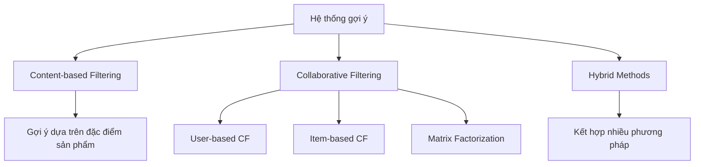
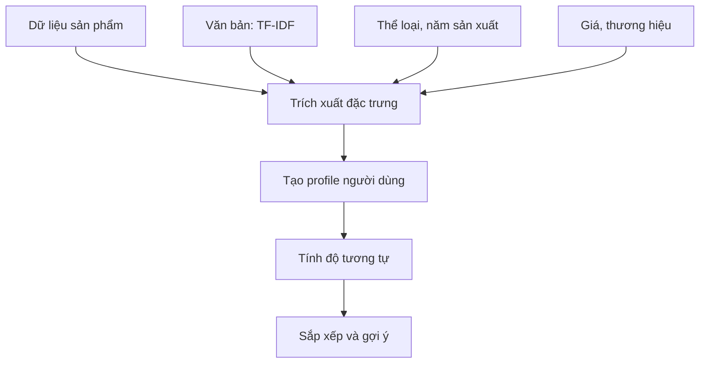
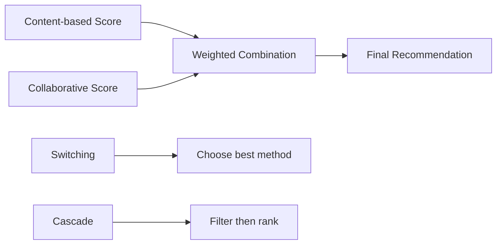

# 🎯 Bài 8: Hệ thống gợi ý (Recommendation Systems)

## 📋 Mục **TF-IDF (Term Frequency-Inverse Document Frequency):**

$$\text{TF-IDF}(t, d) = \text{TF}(t, d) \times \text{IDF}(t)$$

$$\text{TF}(t, d) = \frac{\text{số lần xuất hiện của t trong d}}{\text{tổng số từ trong d}}$$

$$\text{IDF}(t) = \log\left(\frac{\text{tổng số tài liệu}}{1 + \text{số tài liệu chứa t}}\right)$$

#### 🧮 Tính toán thử công TF-IDF với dữ liệu dạng bảng

**Ví dụ đơn giản:** Bộ mô tả 3 phim

| Phim     | Mô tả                                    |
|----------|------------------------------------------|
| Avengers | "action hero fight save world"          |
| Titanic  | "love story ship sink ocean"            |
| Iron Man | "action hero technology armor suit"     |

**Bước 1:** Tính Term Frequency (TF) cho từ "action"

| Phim     | Số lần "action" | Tổng số từ | TF(action) |
|----------|-----------------|------------|------------|
| Avengers | 1               | 5          | 1/5 = 0.2  |
| Titanic  | 0               | 5          | 0/5 = 0.0  |
| Iron Man | 1               | 5          | 1/5 = 0.2  |

**Bước 2:** Tính Inverse Document Frequency (IDF) cho từ "action"
- Tổng số tài liệu: 3
- Số tài liệu chứa "action": 2 (Avengers, Iron Man)

$$\text{IDF}(action) = \log\left(\frac{3}{1 + 2}\right) = \log(1) = 0$$

Wait, this is not right. Let me recalculate:

$$\text{IDF}(action) = \log\left(\frac{3}{2}\right) = \log(1.5) = 0.405$$

**Bước 3:** Tính TF-IDF cho từ "action"

| Phim     | TF(action) | IDF(action) | TF-IDF(action) |
|----------|------------|-------------|----------------|
| Avengers | 0.2        | 0.405       | 0.2×0.405=0.081|
| Titanic  | 0.0        | 0.405       | 0.0×0.405=0.000|
| Iron Man | 0.2        | 0.405       | 0.2×0.405=0.081|

**Bảng TF-IDF hoàn chỉnh cho tất cả từ:**

| Phim     | action | hero | fight | save | world | love | story | ship | sink | ocean | technology | armor | suit |
|----------|--------|------|-------|------|-------|------|-------|------|------|-------|------------|-------|------|
| Avengers | 0.081  | 0.081| 0.162 | 0.162| 0.162 | 0.000| 0.000 | 0.000| 0.000| 0.000 | 0.000      | 0.000 | 0.000|
| Titanic  | 0.000  | 0.000| 0.000 | 0.000| 0.000 | 0.162| 0.081 | 0.162| 0.162| 0.162 | 0.000      | 0.000 | 0.000|
| Iron Man | 0.081  | 0.081| 0.000 | 0.000| 0.000 | 0.000| 0.000 | 0.000| 0.000| 0.000 | 0.162      | 0.162 | 0.162|

**💡 Ý nghĩa của bảng TF-IDF:**

**🔍 Phân tích từng từ khóa:**

**Từ phổ biến (điểm TF-IDF thấp):**
- **"action", "hero"** (0.081): Xuất hiện ở 2/3 phim → Ít đặc trưng, giá trị phân biệt thấp
- **"story"** (0.081): Chỉ ở Titanic nhưng từ phổ biến → Không đủ đặc trưng

**Từ đặc trưng cao (điểm TF-IDF cao):**
- **"fight", "save", "world"** (0.162): Chỉ ở Avengers → Rất đặc trưng cho phim siêu anh hùng
- **"love", "ship", "sink", "ocean"** (0.162): Chỉ ở Titanic → Đặc trưng phim tình cảm/thảm họa
- **"technology", "armor", "suit"** (0.162): Chỉ ở Iron Man → Đặc trưng công nghệ cao

**📊 Phân nhóm theo nội dung:**

| Nhóm phim        | Từ khóa đặc trưng           | TF-IDF Score | Ý nghĩa                    |
|------------------|----------------------------|--------------|----------------------------|
| **Siêu anh hùng** | fight, save, world        | 0.162        | Hành động cứu thế giới     |
| **Tình cảm**     | love, ship, sink, ocean   | 0.162        | Câu chuyện tình yêu bi thương |
| **Công nghệ**    | technology, armor, suit   | 0.162        | Phim khoa học viễn tưởng   |
| **Chung**        | action, hero              | 0.081        | Ít giá trị phân biệt       |

**🎯 Ứng dụng trong gợi ý:**
- User thích phim có từ "fight, save" → Gợi ý Avengers
- User thích "love story" → Gợi ý Titanic  
- User quan tâm "technology" → Gợi ý Iron Man
- Từ "action" không đủ để phân biệt giữa Avengers và Iron Man

**🔧 Tối ưu hóa:**
- **Tăng trọng số** cho các từ có TF-IDF cao (0.162)
- **Giảm trọng số** cho các từ phổ biến (0.081)
- **Bổ sung từ đồng nghĩa** để tăng độ chính xác

học

Sau khi học xong bài này, học viên sẽ có khả năng:
- 🎯 Hiểu được khái niệm và ứng dụng của hệ thống gợi ý
- 🔍 Phân biệt được hai phương pháp chính: Collaborative Filtering và Content-based Filtering
- 📊 Triển khai các thuật toán gợi ý cơ bản bằng Python
- 🎮 Xây dựng hệ thống gợi ý game/phim đơn giản
- 📈 Đánh giá hiệu suất của hệ thống gợi ý

---

## 🏗️ 1. Lý thuyết cơ bản

### 🤔 Hệ thống gợi ý là gì?

Hệ thống gợi ý (Recommendation System) là một hệ thống con của hệ thống lọc thông tin, nhằm dự đoán "mức độ đánh giá" hoặc "sở thích" mà người dùng sẽ dành cho một sản phẩm.

### 🎯 Ứng dụng thực tế

- **🛒 E-commerce**: Amazon gợi ý sản phẩm
- **🎬 Streaming**: Netflix gợi ý phim/series
- **🎵 Music**: Spotify gợi ý bài hát
- **📚 Social Media**: Facebook gợi ý bạn bè
- **🍕 Food Delivery**: Gợi ý món ăn

### 🔧 Các phương pháp chính




---

## 📊 2. Content-based Filtering (Lọc dựa trên nội dung)

### 🎯 Nguyên lý hoạt động

Content-based filtering gợi ý các sản phẩm tương tự với những sản phẩm mà người dùng đã thích trong quá khứ, dựa trên đặc điểm của sản phẩm.


### 🔢 Công thức toán học

**Độ tương tự Cosine:**

$$\text{similarity}(i, j) = \cos(\theta) = \frac{\mathbf{A} \cdot \mathbf{B}}{|\mathbf{A}||\mathbf{B}|} = \frac{\sum_{k=1}^{n} A_k B_k}{\sqrt{\sum_{k=1}^{n} A_k^2} \sqrt{\sum_{k=1}^{n} B_k^2}}$$

Trong đó:
- $\mathbf{A}, \mathbf{B}$: Vector đặc trưng của hai sản phẩm
- $A_k, B_k$: Giá trị đặc trưng thứ k của sản phẩm A và B
- $n$: Số lượng đặc trưng

**TF-IDF (Term Frequency-Inverse Document Frequency):**

$$\text{TF-IDF}(t, d) = \text{TF}(t, d) \times \text{IDF}(t)$$

$$\text{TF}(t, d) = \frac{\text{số lần xuất hiện của t trong d}}{\text{tổng số từ trong d}}$$

$$\text{IDF}(t) = \log\left(\frac{\text{tổng số tài liệu}}{1 + \text{số tài liệu chứa t}}\right)$$


### 🔄 Quy trình hoạt động



### 🧮 Tính toán thử công với dữ liệu dạng bảng

**Ví dụ đơn giản:** Bảng đặc trưng của 4 phim

| Phim         | Action | Romance | Sci-Fi | Comedy |
|--------------|--------|---------|--------|--------|
| Avengers     | 1      | 0       | 1      | 0      |
| Titanic      | 0      | 1       | 0      | 0      |
| Iron Man     | 1      | 0       | 1      | 0      |
| Mr. Bean     | 0      | 0       | 0      | 1      |

**Bước 1:** Tính độ tương tự Cosine giữa Avengers và Iron Man:

- Vector Avengers: [1, 0, 1, 0]
- Vector Iron Man: [1, 0, 1, 0]

$$
\text{similarity} = \frac{\mathbf{A} \cdot \mathbf{B}}{|\mathbf{A}||\mathbf{B}|} = \frac{1 \times 1 + 0 \times 0 + 1 \times 1 + 0 \times 0}{\sqrt{1^2+0^2+1^2+0^2} \times \sqrt{1^2+0^2+1^2+0^2}} = \frac{2}{\sqrt{2} \times \sqrt{2}} = 1.0
$$

**Bước 2:** Tính độ tương tự giữa Avengers và Titanic:

- Vector Avengers: [1, 0, 1, 0]
- Vector Titanic: [0, 1, 0, 0]

$$
\text{similarity} = \frac{1 \times 0 + 0 \times 1 + 1 \times 0 + 0 \times 0}{\sqrt{2} \times \sqrt{1}} = \frac{0}{\sqrt{2}} = 0.0
$$

**Bảng ma trận độ tương tự cuối cùng:**

| Phim         | Avengers | Titanic | Iron Man | Mr. Bean |
|--------------|----------|---------|----------|----------|
| Avengers     | 1.000    | 0.000   | 1.000    | 0.000    |
| Titanic      | 0.000    | 1.000   | 0.000    | 0.000    |
| Iron Man     | 1.000    | 0.000   | 1.000    | 0.000    |
| Mr. Bean     | 0.000    | 0.000   | 0.000    | 1.000    |

**💡 Ý nghĩa của ma trận:**
- **Đường chéo = 1.000**: Mỗi phim với chính nó có độ tương tự hoàn hảo
- **Avengers-Iron Man = 1.000**: Hai phim có đặc trưng giống hệt nhau (cùng Action + Sci-Fi)
- **Titanic với tất cả = 0.000**: Phim tình cảm hoàn toàn khác biệt với phim hành động
- **Mr. Bean độc lập**: Phim hài không có điểm chung với bất kỳ phim nào

**🎯 Ứng dụng thực tế:**
- Nếu user thích Avengers → Hệ thống sẽ gợi ý Iron Man (similarity = 1.0)
- Nếu user thích Titanic → Không có phim tương tự để gợi ý
- Điều này cho thấy tầm quan trọng của việc có đủ đa dạng thể loại trong database

### 💻 Ví dụ minh họa: Hệ thống gợi ý phim

```python
import pandas as pd
import numpy as np
from sklearn.feature_extraction.text import TfidfVectorizer
from sklearn.metrics.pairwise import cosine_similarity

# Dữ liệu mẫu về phim
movies_data = {
    'title': ['Avengers', 'Iron Man', 'Spider-Man', 'Titanic', 'The Notebook'],
    'genre': ['Action Adventure Sci-Fi', 'Action Adventure Sci-Fi', 
              'Action Adventure Sci-Fi', 'Drama Romance', 'Drama Romance'],
    'description': [
        'superheroes save world team fight aliens',
        'genius billionaire armor suit technology',
        'teenager spider powers responsibility',
        'ship sinks love story ocean',
        'love story memory disease'
    ]
}

df_movies = pd.DataFrame(movies_data)
print("Dữ liệu phim:")
print(df_movies)
```

### 🧮 Tính toán bước by bước

```python
# Bước 1: Kết hợp thông tin để tạo features
df_movies['features'] = df_movies['genre'] + ' ' + df_movies['description']

# Bước 2: Tạo TF-IDF vectors
tfidf = TfidfVectorizer(stop_words='english')
tfidf_matrix = tfidf.fit_transform(df_movies['features'])

print(f"Kích thước ma trận TF-IDF: {tfidf_matrix.shape}")
print(f"Các từ khóa: {list(tfidf.get_feature_names_out()[:10])}")
```

```python
# Bước 3: Tính ma trận độ tương tự
similarity_matrix = cosine_similarity(tfidf_matrix)

print("Ma trận độ tương tự:")
similarity_df = pd.DataFrame(similarity_matrix, 
                           index=df_movies['title'], 
                           columns=df_movies['title'])
print(similarity_df.round(3))
```

### 🎯 Hàm gợi ý

```python
def content_based_recommend(movie_title, similarity_df, top_n=3):
    """
    Gợi ý phim dựa trên content-based filtering
    
    Parameters:
    movie_title: Tên phim làm cơ sở
    similarity_df: Ma trận độ tương tự
    top_n: Số lượng phim gợi ý
    
    Returns:
    List các phim được gợi ý
    """
    # Lấy điểm tương tự của phim đã chọn
    movie_scores = similarity_df[movie_title].sort_values(ascending=False)
    
    # Loại bỏ chính nó và lấy top_n phim
    recommended_movies = movie_scores.iloc[1:top_n+1]
    
    print(f"Gợi ý cho phim '{movie_title}':")
    for i, (title, score) in enumerate(recommended_movies.items(), 1):
        print(f"{i}. {title} (độ tương tự: {score:.3f})")
    
    return recommended_movies

# Test hàm gợi ý
content_based_recommend('Iron Man', similarity_df)
```

---

## 🤝 3. Collaborative Filtering (Lọc cộng tác)

### 🎯 Nguyên lý hoạt động

Collaborative Filtering dự đoán sở thích của người dùng dựa trên hành vi của những người dùng tương tự (User-based) hoặc sản phẩm tương tự (Item-based).


### 📊 Hai phương pháp chính

#### 👥 User-based Collaborative Filtering

**Công thức tính độ tương tự giữa người dùng:**

$$\text{sim}(u, v) = \frac{\sum_{i \in I_{uv}} (r_{ui} - \bar{r}_u)(r_{vi} - \bar{r}_v)}{\sqrt{\sum_{i \in I_{uv}} (r_{ui} - \bar{r}_u)^2} \sqrt{\sum_{i \in I_{uv}} (r_{vi} - \bar{r}_v)^2}}$$

**Công thức dự đoán rating:**

$$\hat{r}_{ui} = \bar{r}_u + \frac{\sum_{v \in N(u)} \text{sim}(u,v) \times (r_{vi} - \bar{r}_v)}{\sum_{v \in N(u)} |\text{sim}(u,v)|}$$

Trong đó:
- $r_{ui}$: Rating của user u cho item i
- $\bar{r}_u$: Rating trung bình của user u
- $I_{uv}$: Tập các item được đánh giá bởi cả u và v
- $N(u)$: Tập những user tương tự với u

#### 🎭 Item-based Collaborative Filtering

**Công thức tính độ tương tự giữa sản phẩm:**

$$\text{sim}(i, j) = \frac{\sum_{u \in U_{ij}} (r_{ui} - \bar{r}_i)(r_{uj} - \bar{r}_j)}{\sqrt{\sum_{u \in U_{ij}} (r_{ui} - \bar{r}_i)^2} \sqrt{\sum_{u \in U_{ij}} (r_{uj} - \bar{r}_j)^2}}$$

#### 🧮 Tính toán thử công Item-based CF với dữ liệu dạng bảng

**Ví dụ đơn giản:** Bảng rating của 4 user cho 4 phim

| User | Avengers | Titanic | Iron Man | Spider-Man |
|------|----------|---------|----------|------------|
| 1    | 5        | 2       | 4        | 3          |
| 2    | 4        | 3       | 5        | 4          |
| 3    | 1        | 5       | 2        | 3          |
| 4    | 5        | 1       | 4        | 5          |

**Mục tiêu:** Tính độ tương tự giữa Avengers và Iron Man

**Bước 1:** Lấy rating của cả hai phim từ tất cả users:
- Avengers: [5, 4, 1, 5], trung bình: 3.75
- Iron Man: [4, 5, 2, 4], trung bình: 3.75

**Bước 2:** Tính độ tương tự Pearson Correlation:

$$
\text{sim}(Avengers, Iron Man) = \frac{\sum_{u} (r_{u,Avengers} - \bar{r}_{Avengers})(r_{u,Iron Man} - \bar{r}_{Iron Man})}{\sqrt{\sum_{u} (r_{u,Avengers} - \bar{r}_{Avengers})^2} \sqrt{\sum_{u} (r_{u,Iron Man} - \bar{r}_{Iron Man})^2}}
$$

Tính từng thành phần:
- User 1: (5-3.75)(4-3.75) = 1.25 × 0.25 = 0.3125
- User 2: (4-3.75)(5-3.75) = 0.25 × 1.25 = 0.3125  
- User 3: (1-3.75)(2-3.75) = (-2.75) × (-1.75) = 4.8125
- User 4: (5-3.75)(4-3.75) = 1.25 × 0.25 = 0.3125

Tổng tử số = 0.3125 + 0.3125 + 4.8125 + 0.3125 = 5.75

**Bước 3:** Tính mẫu số:
- Avengers: √[(1.25)² + (0.25)² + (-2.75)² + (1.25)²] = √[1.5625 + 0.0625 + 7.5625 + 1.5625] = √10.75 = 3.28
- Iron Man: √[(0.25)² + (1.25)² + (-1.75)² + (0.25)²] = √[0.0625 + 1.5625 + 3.0625 + 0.0625] = √4.75 = 2.18

$$
\text{similarity} = \frac{5.75}{3.28 × 2.18} = \frac{5.75}{7.15} = 0.80
$$

**Bảng ma trận độ tương tự Item-based:**

| Phim       | Avengers | Titanic | Iron Man | Spider-Man |
|------------|----------|---------|----------|------------|
| Avengers   | 1.00     | -0.87   | 0.80     | 0.94       |
| Titanic    | -0.87    | 1.00    | -0.77    | -0.58      |
| Iron Man   | 0.80     | -0.77   | 1.00     | 0.89       |
| Spider-Man | 0.94     | -0.58   | 0.89     | 1.00       |

**💡 Ý nghĩa của ma trận Item-based:**

**🎬 Phân nhóm phim rõ ràng:**
- **Nhóm hành động**: Avengers, Iron Man, Spider-Man có độ tương tự cao (0.80-0.94)
- **Phim tình cảm**: Titanic có độ tương tự âm với tất cả phim hành động (-0.58 đến -0.87)

**📊 Phân tích từng cặp phim:**
- **Avengers-Spider-Man (0.94)**: Siêu anh hùng giống nhau nhất
- **Avengers-Iron Man (0.80)**: Cùng vũ trụ Marvel, tương tự cao
- **Iron Man-Spider-Man (0.89)**: Cùng công nghệ + siêu năng lực
- **Titanic-Avengers (-0.87)**: Hoàn toàn đối lập (tình cảm vs hành động)

**🎯 Ứng dụng trong gợi ý:**
- Nếu user xem Avengers → Gợi ý Spider-Man (similarity cao nhất 0.94)
- Nếu user không thích Titanic → Có thể sẽ thích các phim hành động
- Nếu user thích Iron Man → Gợi ý Spider-Man (0.89) trước Avengers (0.80)

**🔍 Insight kinh doanh:**
- **Cross-selling hiệu quả**: Người xem phim Marvel có xu hướng xem thêm phim Marvel khác
- **Phân khúc rõ ràng**: Khách hàng yêu thích hành động vs tình cảm có sở thích trái ngược
- **Chiến lược marketing**: Có thể tạo gói combo phim cùng thể loại

**Kết luận:** Avengers và Iron Man có độ tương tự cao (0.80), trong khi Titanic có xu hướng ngược lại với các phim hành động.

### 🧮 Tính toán thử công User-based CF với dữ liệu dạng bảng

**Ví dụ đơn giản:** Bảng rating của 4 user cho 4 phim

| User | Avengers | Titanic | Iron Man | Spider-Man |
|------|----------|---------|----------|------------|
| 1    | 5        | 2       | 4        | ?          |
| 2    | 4        | 3       | 5        | 4          |
| 3    | 1        | 5       | 2        | 3          |
| 4    | 5        | 1       | 4        | 5          |

**Mục tiêu:** Dự đoán rating của User 1 cho Spider-Man

**Bước 1:** Tính độ tương tự giữa User 1 và các user khác (chỉ dùng các phim cả hai đều đã rating)

User 1 vs User 2 (dùng Avengers, Titanic, Iron Man):
- User 1: [5, 2, 4], trung bình: 3.67
- User 2: [4, 3, 5], trung bình: 4.0

$$
\text{similarity} = \frac{(5-3.67)(4-4.0) + (2-3.67)(3-4.0) + (4-3.67)(5-4.0)}{\sqrt{(5-3.67)^2+(2-3.67)^2+(4-3.67)^2} \times \sqrt{(4-4.0)^2+(3-4.0)^2+(5-4.0)^2}}
$$

$$
= \frac{1.33 \times (-0) + (-1.67) \times (-1) + 0.33 \times 1}{\sqrt{1.77+2.79+0.11} \times \sqrt{0+1+1}} = \frac{0 + 1.67 + 0.33}{\sqrt{4.67} \times \sqrt{2}} = \frac{2.0}{2.16 \times 1.41} = 0.66
$$

**Bước 2:** Tương tự tính User 1 vs User 3 và User 1 vs User 4:
- similarity(1,3) = -0.85 (ngược chiều)
- similarity(1,4) = 0.95 (rất giống)

**Bước 3:** Dự đoán rating cho Spider-Man:

$$
\hat{r}_{1,Spider-Man} = \bar{r}_1 + \frac{\sum_{u \in N} sim(1,u) \times (r_{u,Spider-Man} - \bar{r}_u)}{\sum_{u \in N} |sim(1,u)|}
$$

$$
= 3.67 + \frac{0.66 \times (4-4.0) + (-0.85) \times (3-3.33) + 0.95 \times (5-3.67)}{0.66 + 0.85 + 0.95}
$$

$$
= 3.67 + \frac{0.66 \times 0 + (-0.85) \times (-0.33) + 0.95 \times 1.33}{2.46} = 3.67 + \frac{0 + 0.28 + 1.26}{2.46} = 3.67 + 0.63 = 4.3
$$

**💡 Ý nghĩa của kết quả:**
- **Rating dự đoán = 4.3**: User 1 có khả năng sẽ đánh giá Spider-Man 4.3/5 sao
- **Cao hơn trung bình cá nhân (3.67)**: User 1 sẽ thích Spider-Man hơn mức trung bình
- **Đóng góp chính từ User 4**: similarity(1,4) = 0.95 là cao nhất, User 4 thích Spider-Man (5 sao)
- **User 3 ít ảnh hưởng**: similarity(1,3) = -0.85 (âm) nên đánh giá thấp của User 3 không làm giảm dự đoán

**🔍 Phân tích chi tiết bảng tương tự:**

| So sánh      | Similarity | Ý nghĩa                                    |
|--------------|------------|-------------------------------------------|
| User 1 vs 2  | 0.66       | Tương đối giống nhau, ảnh hưởng trung bình |
| User 1 vs 3  | -0.85      | Ngược chiều hoàn toàn, sở thích đối lập   |
| User 1 vs 4  | 0.95       | Rất giống nhau, ảnh hưởng mạnh nhất       |

**🎯 Ứng dụng thực tế:**
- Hệ thống sẽ ưu tiên gợi ý Spider-Man cho User 1 (điểm cao 4.3)
- Độ tin cậy cao vì có User 4 rất tương tự và đánh giá tích cực
- User 3 có sở thích ngược lại nên không ảnh hưởng tiêu cực đến dự đoán

**Kết luận:** Dự đoán User 1 sẽ cho Spider-Man điểm 4.3

### 💻 Ví dụ thực hành: User-based CF

```python
import pandas as pd
import numpy as np
from sklearn.metrics.pairwise import cosine_similarity

# Tạo dữ liệu rating mẫu (User-Item matrix)
ratings_data = {
    'user': [1, 1, 1, 2, 2, 3, 3, 3, 4, 4, 5, 5, 5],
    'item': ['A', 'B', 'C', 'A', 'C', 'B', 'C', 'D', 'A', 'D', 'B', 'C', 'D'],
    'rating': [5, 3, 4, 4, 5, 3, 4, 5, 5, 4, 4, 3, 4]
}

df_ratings = pd.DataFrame(ratings_data)

# Tạo User-Item matrix
user_item_matrix = df_ratings.pivot(index='user', columns='item', values='rating')
print("Ma trận User-Item:")
print(user_item_matrix.fillna(0))
```


```python
# Điền giá trị thiếu bằng 0 và tính ma trận tương tự
user_matrix_filled = user_item_matrix.fillna(0)
user_similarity = cosine_similarity(user_matrix_filled)

print("Ma trận độ tương tự giữa các user:")
user_sim_df = pd.DataFrame(user_similarity, 
                          index=user_item_matrix.index, 
                          columns=user_item_matrix.index)
print(user_sim_df.round(3))
```

### 🔮 Hàm dự đoán rating

```python
def predict_rating_user_based(user_id, item_id, user_item_matrix, user_similarity, k=2):
    """
    Dự đoán rating cho user-item bằng User-based CF
    
    Parameters:
    user_id: ID của user
    item_id: ID của item
    user_item_matrix: Ma trận User-Item
    user_similarity: Ma trận độ tương tự user
    k: Số lượng user tương tự sử dụng
    
    Returns:
    Predicted rating
    """
    # Nếu user đã rating item này
    if not pd.isna(user_item_matrix.loc[user_id, item_id]):
        return user_item_matrix.loc[user_id, item_id]
    
    # Tìm k user tương tự nhất đã rating item này
    user_ratings = user_item_matrix[item_id].dropna()
    similarities = user_similarity[user_id-1]  # Chuyển về index 0
    
    # Tính rating trung bình của user
    user_mean = user_item_matrix.loc[user_id].mean()
    
    numerator = 0
    denominator = 0
    
    for other_user_id in user_ratings.index:
        if other_user_id != user_id:
            similarity = similarities[other_user_id-1]
            other_rating = user_ratings[other_user_id]
            other_mean = user_item_matrix.loc[other_user_id].mean()
            
            numerator += similarity * (other_rating - other_mean)
            denominator += abs(similarity)
    
    if denominator == 0:
        return user_mean
    
    predicted_rating = user_mean + (numerator / denominator)
    return max(1, min(5, predicted_rating))  # Giới hạn trong khoảng [1, 5]

# Test dự đoán
predicted = predict_rating_user_based(1, 'D', user_item_matrix, user_similarity)
print(f"Dự đoán rating của User 1 cho Item D: {predicted:.2f}")
```

---

## 🔧 4. Triển khai thực tế với Python

### 📦 Cài đặt thư viện cần thiết

```python
# requirements.txt
pandas==1.5.3
numpy==1.24.3
scikit-learn==1.2.2
matplotlib==3.7.1
seaborn==0.12.2
nltk==3.8.1
streamlit==1.22.0
```

### 🎮 Xây dựng hệ thống gợi ý game

```python
import pandas as pd
import numpy as np
from sklearn.feature_extraction.text import TfidfVectorizer
from sklearn.metrics.pairwise import cosine_similarity
import nltk
from nltk.stem.snowball import SnowballStemmer
import re

class GameRecommendationSystem:
    def __init__(self):
        self.games_df = None
        self.tfidf_vectorizer = None
        self.similarity_matrix = None
        self.stemmer = SnowballStemmer("english")
    
    def tokenize_and_stem(self, text):
        """Tokenize và stem text"""
        # Tokenize
        tokens = [word for sent in nltk.sent_tokenize(text) 
                  for word in nltk.word_tokenize(sent)]
        
        # Lọc token
        filtered_tokens = [token for token in tokens if re.search('[a-zA-Z]', token)]
        
        # Stem
        stems = [self.stemmer.stem(word) for word in filtered_tokens]
        
        return stems
    
    def load_data(self, file_path):
        """Load dữ liệu game"""
        self.games_df = pd.read_csv(file_path)
        print(f"Đã load {len(self.games_df)} games")
    
    def build_features(self):
        """Xây dựng features cho recommendation"""
        # Tạo TF-IDF vectors
        self.tfidf_vectorizer = TfidfVectorizer(
            max_df=0.8,
            max_features=200000,
            min_df=0.2,
            stop_words='english',
            use_idf=True,
            tokenizer=self.tokenize_and_stem,
            ngram_range=(1, 3)
        )
        
        tfidf_matrix = self.tfidf_vectorizer.fit_transform(self.games_df["description"])
        
        # Tính ma trận độ tương tự
        self.similarity_matrix = cosine_similarity(tfidf_matrix)
        
        print("Đã xây dựng xong features và ma trận tương tự")
    
    def recommend_games(self, game_title, top_n=5):
        """Gợi ý games tương tự"""
        try:
            # Tìm index của game
            game_idx = self.games_df[self.games_df['title'] == game_title].index[0]
            
            # Lấy điểm tương tự
            sim_scores = list(enumerate(self.similarity_matrix[game_idx]))
            
            # Sắp xếp theo điểm tương tự
            sim_scores = sorted(sim_scores, key=lambda x: x[1], reverse=True)
            
            # Lấy top_n (không kể chính nó)
            sim_scores = sim_scores[1:top_n+1]
            
            # Lấy indices
            game_indices = [i[0] for i in sim_scores]
            
            # Return games
            recommended_games = self.games_df.iloc[game_indices][['title', 'genre']]
            recommended_games['similarity_score'] = [score[1] for score in sim_scores]
            
            return recommended_games
            
        except IndexError:
            print(f"Không tìm thấy game '{game_title}'")
            return None

# Sử dụng hệ thống
# recommender = GameRecommendationSystem()
# recommender.load_data('games_dataset.csv')
# recommender.build_features()
# recommendations = recommender.recommend_games('Super Mario Bros')
# print(recommendations)
```

---

## 📈 5. Đánh giá hiệu suất

### 🎯 Các metrics đánh giá

### 📊 Accuracy Metrics

#### 🧮 Tính toán thử công MAE và RMSE với dữ liệu dạng bảng

**Ví dụ đơn giản:** So sánh rating thực tế và dự đoán

| User-Item | Rating thực tế | Rating dự đoán | Sai số tuyệt đối | Sai số bình phương |
|-----------|----------------|----------------|------------------|--------------------|
| U1-I1     | 4.0           | 3.8            | |4.0-3.8|=0.2     | (4.0-3.8)²=0.04   |
| U1-I2     | 3.0           | 3.5            | |3.0-3.5|=0.5     | (3.0-3.5)²=0.25   |
| U2-I1     | 5.0           | 4.2            | |5.0-4.2|=0.8     | (5.0-4.2)²=0.64   |
| U2-I2     | 2.0           | 2.5            | |2.0-2.5|=0.5     | (2.0-2.5)²=0.25   |
| U3-I1     | 4.5           | 4.0            | |4.5-4.0|=0.5     | (4.5-4.0)²=0.25   |

**Bước 1:** Tính Mean Absolute Error (MAE):

$$MAE = \frac{1}{n} \sum_{i=1}^{n} |y_i - \hat{y}_i| = \frac{0.2 + 0.5 + 0.8 + 0.5 + 0.5}{5} = \frac{2.5}{5} = 0.5$$

**Bước 2:** Tính Root Mean Square Error (RMSE):

$$RMSE = \sqrt{\frac{1}{n} \sum_{i=1}^{n} (y_i - \hat{y}_i)^2} = \sqrt{\frac{0.04 + 0.25 + 0.64 + 0.25 + 0.25}{5}} = \sqrt{\frac{1.43}{5}} = \sqrt{0.286} = 0.535$$

**💡 Ý nghĩa của MAE và RMSE:**

**📊 So sánh các metrics:**
- **MAE = 0.5**: Sai số trung bình là 0.5 điểm rating
- **RMSE = 0.535**: Cao hơn MAE, cho thấy có sai số lớn

**🔍 Phân tích chi tiết:**
- **Sai số nhỏ** (U1-I1: 0.2): Dự đoán tốt, gần với thực tế
- **Sai số trung bình** (U1-I2, U2-I2, U3-I1: 0.5): Chấp nhận được
- **Sai số lớn** (U2-I1: 0.8): Dự đoán kém, cần cải thiện

**⚖️ Đánh giá chất lượng hệ thống:**

| Khoảng MAE | Chất lượng    | Ý nghĩa                           |
|------------|---------------|-----------------------------------|
| 0.0 - 0.3  | Xuất sắc      | Dự đoán rất chính xác            |
| 0.3 - 0.5  | Tốt           | Chấp nhận được cho production     |
| 0.5 - 0.7  | Trung bình    | Cần cải thiện thuật toán         |
| > 0.7      | Kém           | Không nên deploy                 |

**🎯 Hành động cải thiện:**
- **MAE = 0.5** → Hệ thống ở mức **trung bình**, cần tối ưu
- **RMSE > MAE** → Có outliers (U2-I1), cần xử lý đặc biệt
- **Gợi ý**: Điều chỉnh tham số, bổ sung features, hoặc kết hợp nhiều mô hình

**Kết luận:** MAE = 0.5, RMSE = 0.535. RMSE cao hơn MAE cho thấy có một số sai số lớn (như U2-I1).

#### 🎯 Ranking Metrics

#### 🧮 Tính toán thử công Precision@K và Recall@K

**Ví dụ:** Gợi ý top-5 phim cho user, trong đó user thực sự thích 8 phim

**Kết quả gợi ý top-5:**
| Thứ tự | Phim gợi ý | Thực tế thích? |
|--------|------------|----------------|
| 1      | Avengers   | ✓ Có           |
| 2      | Iron Man   | ✓ Có           |
| 3      | Titanic    | ✗ Không        |
| 4      | Spider-Man | ✓ Có           |
| 5      | Batman     | ✗ Không        |

**Relevant items:** Tổng 8 phim user thực sự thích
**Retrieved@5:** 5 phim được gợi ý
**Relevant ∩ Retrieved@5:** 3 phim (Avengers, Iron Man, Spider-Man)

**Bước 1:** Tính Precision@5:
$$Precision@5 = \frac{|Relevant \cap Retrieved@5|}{K} = \frac{3}{5} = 0.6 = 60\%$$

**Bước 2:** Tính Recall@5:
$$Recall@5 = \frac{|Relevant \cap Retrieved@5|}{|Relevant|} = \frac{3}{8} = 0.375 = 37.5\%$$

**Bảng so sánh với các K khác nhau:**

| K  | Relevant trong top-K | Precision@K | Recall@K |
|----|---------------------|-------------|----------|
| 1  | 1                   | 1/1 = 100%  | 1/8 = 12.5% |
| 3  | 2                   | 2/3 = 66.7% | 2/8 = 25%   |
| 5  | 3                   | 3/5 = 60%   | 3/8 = 37.5% |
| 10 | 5                   | 5/10 = 50%  | 5/8 = 62.5% |

**💡 Ý nghĩa của Precision@K và Recall@K:**

**🎯 Giải thích các chỉ số:**
- **Precision@K**: Tỷ lệ phim "đúng gu" trong K phim được gợi ý
- **Recall@K**: Tỷ lệ phim yêu thích được "tìm ra" trong top-K
- **Trade-off**: Precision giảm khi K tăng, nhưng Recall tăng

**📊 Phân tích từng mức K:**

**K=1 (Gợi ý duy nhất):**
- **Precision = 100%**: Chắc chắn đúng gu, nhưng rất hạn chế
- **Recall = 12.5%**: Chỉ tìm được 1/8 phim yêu thích
- **Ứng dụng**: Gợi ý "phim hot nhất" cho homepage

**K=5 (Gợi ý tiêu chuẩn):**
- **Precision = 60%**: 3/5 phim đúng gu, chất lượng khá tốt
- **Recall = 37.5%**: Tìm được gần 40% sở thích của user
- **Ứng dụng**: Danh sách gợi ý chính trên trang web

**K=10 (Gợi ý mở rộng):**
- **Precision = 50%**: Chất lượng giảm nhưng vẫn chấp nhận được
- **Recall = 62.5%**: Tìm được hơn một nửa sở thích
- **Ứng dụng**: Trang "khám phá thêm" hoặc email marketing

**🔍 Insight kinh doanh:**

| Chiến lược    | K tối ưu | Lý do                               | Ứng dụng               |
|---------------|----------|-------------------------------------|------------------------|
| **Chất lượng cao** | K=1-3    | Precision cao, ít rủi ro user không thích | Homepage, notification |
| **Cân bằng**      | K=5-7    | Cân bằng giữa chất lượng và đa dạng    | Trang chính, carousel  |
| **Khám phá**      | K=10+    | Recall cao, giúp user tìm sở thích mới | Trang browse, search   |

**⚡ Tối ưu hóa thực tế:**
- **A/B Testing**: Thử nghiệm K khác nhau để tìm conversion rate tốt nhất
- **Personalized K**: User mới dùng K nhỏ (precision cao), user cũ dùng K lớn (đa dạng)
- **Context-aware**: K nhỏ trên mobile, K lớn trên desktop

**Kết luận:** Precision giảm khi K tăng (chất lượng giảm), nhưng Recall tăng (độ phủ tăng).

**Mean Absolute Error (MAE):**
$$MAE = \frac{1}{|T|} \sum_{(u,i) \in T} |r_{ui} - \hat{r}_{ui}|$$

**Root Mean Square Error (RMSE):**
$$RMSE = \sqrt{\frac{1}{|T|} \sum_{(u,i) \in T} (r_{ui} - \hat{r}_{ui})^2}$$

#### 🎯 Ranking Metrics
**Precision@K:**
$$Precision@K = \frac{|Relevant \cap Retrieved@K|}{K}$$

**Recall@K:**
$$Recall@K = \frac{|Relevant \cap Retrieved@K|}{|Relevant|}$$

### 💻 Code đánh giá

```python
from sklearn.model_selection import train_test_split
from sklearn.metrics import mean_absolute_error, mean_squared_error
import numpy as np

def evaluate_recommendation_system(true_ratings, predicted_ratings):
    """Đánh giá hệ thống gợi ý"""
    mae = mean_absolute_error(true_ratings, predicted_ratings)
    rmse = np.sqrt(mean_squared_error(true_ratings, predicted_ratings))
    
    print(f"Mean Absolute Error (MAE): {mae:.3f}")
    print(f"Root Mean Square Error (RMSE): {rmse:.3f}")
    
    return {'MAE': mae, 'RMSE': rmse}

def precision_at_k(recommended_items, relevant_items, k):
    """Tính Precision@K"""
    recommended_k = recommended_items[:k]
    relevant_and_recommended = set(recommended_k) & set(relevant_items)
    return len(relevant_and_recommended) / k

def recall_at_k(recommended_items, relevant_items, k):
    """Tính Recall@K"""
    recommended_k = recommended_items[:k]
    relevant_and_recommended = set(recommended_k) & set(relevant_items)
    return len(relevant_and_recommended) / len(relevant_items)
```

---

## 🔄 6. So sánh các phương pháp

| Đặc điểm | Content-based | Collaborative Filtering |
|----------|---------------|------------------------|
| **🎯 Nguyên lý** | Đặc trưng sản phẩm | Hành vi người dùng |
| **✅ Ưu điểm** | Không cần dữ liệu user khác<br>Giải thích được | Không cần phân tích nội dung<br>Khám phá được sở thích mới |
| **❌ Nhược điểm** | Hạn chế đa dạng<br>Cần domain knowledge | Cold start problem<br>Data sparsity |
| **🎮 Ứng dụng** | News, Documents | E-commerce, Movies |

### 🔗 Hybrid Methods

#### 🧮 Tính toán thử công Hybrid Recommendation với dữ liệu dạng bảng

**Ví dụ:** Kết hợp Content-based và Collaborative Filtering

**Bước 1:** Điểm từ Content-based (dựa trên đặc trưng phim)

| User | Phim      | Content Score | Lý do                              |
|------|-----------|---------------|-----------------------------------|
| 1    | Iron Man  | 0.85         | Giống Avengers (đã thích)         |
| 1    | Titanic   | 0.20         | Khác biệt hoàn toàn với sở thích  |
| 1    | Batman    | 0.90         | Rất giống phim hành động đã thích |

**Bước 2:** Điểm từ Collaborative Filtering (dựa trên user tương tự)

| User | Phim      | CF Score | Lý do                                    |
|------|-----------|----------|------------------------------------------|
| 1    | Iron Man  | 0.75     | Users tương tự đánh giá cao             |
| 1    | Titanic   | 0.45     | Một số users tương tự thích             |
| 1    | Batman    | 0.80     | Đa số users tương tự đánh giá tích cực  |

**Bước 3:** Kết hợp bằng Weighted Average (α = 0.6 cho Content-based, β = 0.4 cho CF)

$$\text{Final Score} = \alpha \times \text{Content Score} + \beta \times \text{CF Score}$$

| User | Phim      | Content | CF   | Final Score | Calculation |
|------|-----------|---------|------|-------------|-------------|
| 1    | Iron Man  | 0.85    | 0.75 | 0.81        | 0.6×0.85 + 0.4×0.75 = 0.51 + 0.30 = 0.81 |
| 1    | Titanic   | 0.20    | 0.45 | 0.30        | 0.6×0.20 + 0.4×0.45 = 0.12 + 0.18 = 0.30 |
| 1    | Batman    | 0.90    | 0.80 | 0.86        | 0.6×0.90 + 0.4×0.80 = 0.54 + 0.32 = 0.86 |

**💡 Ý nghĩa của kết quả Hybrid:**

**🎯 Phân tích từng phim:**

**Batman (Final Score = 0.86) - ĐƯỢC GỢI Ý TOP 1:**
- **Content-based = 0.90**: Rất giống phim hành động user đã thích
- **CF = 0.80**: Users tương tự cũng đánh giá cao
- **Kết hợp**: Cả hai phương pháp đều đồng ý → Độ tin cậy cao

**Iron Man (Final Score = 0.81) - GỢI Ý THỨ 2:**
- **Content-based = 0.85**: Giống Avengers (cùng thể loại)
- **CF = 0.75**: Một số users tương tự thích, nhưng không mạnh bằng Batman
- **Kết hợp**: Điểm tốt nhưng thấp hơn Batman do CF score thấp hơn

**Titanic (Final Score = 0.30) - KHÔNG GỢI Ý:**
- **Content-based = 0.20**: Khác biệt hoàn toàn với sở thích hiện tại
- **CF = 0.45**: Một số users có sở thích đa dạng đã xem
- **Kết hợp**: CF score cao hơn nhưng không đủ bù đắp Content score thấp

**🔍 Ưu điểm của Hybrid Method:**

| Vấn đề                | Content-based | CF  | Hybrid Solution |
|----------------------|---------------|-----|-----------------|
| **Cold Start**       | ✅ Giải quyết được | ❌ Không giải quyết được | ✅ Dùng Content khi thiếu data CF |
| **Over-specialization** | ❌ Chỉ gợi ý giống nhau | ✅ Đa dạng | ✅ CF bổ sung sự đa dạng |
| **Độ chính xác**     | ⚡ Trung bình | ⚡ Trung bình | ✅ Cao hơn cả hai |

**⚖️ Điều chỉnh trọng số α và β:**
- **α=0.8, β=0.2**: Ưu tiên Content → Phù hợp user mới, item mới
- **α=0.4, β=0.6**: Ưu tiên CF → Phù hợp user cũ, hệ thống lớn
- **α=0.6, β=0.4**: Cân bằng → Phù hợp đa số trường hợp

**🎯 Chiến lược thực tế:**
- **New user**: α cao → Dựa vào đặc trưng sản phẩm
- **Active user**: β cao → Dựa vào hành vi community  
- **Popular items**: Dùng CF nhiều hơn
- **Niche items**: Dùng Content nhiều hơn

**Kết quả cuối cùng:** Batman (0.86) > Iron Man (0.81) > Titanic (0.30)

**Các phương pháp Hybrid khác:**

| Phương pháp | Cách hoạt động | Ví dụ tính toán |
|-------------|----------------|-----------------|
| **Switching** | Chọn phương pháp tốt nhất | Nếu user mới: dùng Content-based<br>Nếu user cũ: dùng CF |
| **Cascade** | Lọc dần qua từng giai đoạn | Bước 1: Content-based lọc top-100<br>Bước 2: CF sắp xếp lại top-10 |
| **Feature Combination** | Kết hợp features | Vector = [Content Features + CF Features] |



---

## 💪 7. Bài tập thực hành

### 🎯 Bài tập 1: Xây dựng hệ thống gợi ý phim
Sử dụng MovieLens dataset để:
1. Implement User-based CF
2. Implement Item-based CF  
3. So sánh hiệu suất hai phương pháp

### 🎯 Bài tập 2: Content-based cho sản phẩm
Tạo hệ thống gợi ý sản phẩm dựa trên:
1. Mô tả sản phẩm (TF-IDF)
2. Đặc trưng category, price, brand
3. Kết hợp cả hai

### 🎯 Bài tập 3: Đánh giá và tối ưu
1. Implement cross-validation cho recommendation
2. Tính toán các metrics: MAE, RMSE, Precision@K
3. Tối ưu hyperparameters

---

## 🏆 8. Ưu và nhược điểm

### ✅ Ưu điểm của Recommendation Systems
- **🎯 Cá nhân hóa**: Tạo trải nghiệm riêng cho từng user
- **💰 Tăng doanh thu**: Khuyến khích mua sắm thêm
- **⏰ Tiết kiệm thời gian**: Giúp user tìm sản phẩm nhanh hơn
- **🔍 Khám phá**: Giới thiệu sản phẩm mới user chưa biết

### ❌ Thách thức
- **🆕 Cold Start**: Khó gợi ý cho user/item mới
- **📊 Data Sparsity**: Ma trận rating thường rất thưa
- **🔄 Scalability**: Khó mở rộng với dữ liệu lớn
- **🎭 Filter Bubble**: Có thể tạo bong bóng lọc thông tin

---

## 📚 9. Tài liệu tham khảo

### 📖 Sách và bài viết
1. **"Recommender Systems: An Introduction"** - Jannach et al.
2. **"Programming Collective Intelligence"** - Toby Segaran
3. **"Hands-On Recommendation Systems with Python"** - Rounak Banik

### 🌐 Nguồn online
1. [Coursera - Recommender Systems Specialization](https://www.coursera.org/specializations/recommender-systems)
2. [Surprise Library Documentation](https://surprise.readthedocs.io/)
3. [Netflix Prize Competition](https://www.kaggle.com/netflix-inc/netflix-prize-data)

### 🔧 Thư viện và tools
1. **Surprise**: Thư viện Python cho collaborative filtering
2. **LightFM**: Hybrid recommendation algorithms  
3. **Implicit**: Fast collaborative filtering for implicit datasets
4. **TensorFlow Recommenders**: Deep learning cho recommendation

### 📊 Datasets thực hành
1. **MovieLens**: http://movielens.org/
2. **Amazon Product Data**: http://jmcauley.ucsd.edu/data/amazon/
3. **Last.fm**: https://www.last.fm/api
4. **Goodreads**: https://sites.google.com/eng.ucsd.edu/ucsdbookgraph/

---

## 🎨 Visual Illustrations

### 📊 Tổng quan các phương pháp


### 🤝 Collaborative Filtering Process


### 📊 Content-based Filtering


### 📈 User-Item Matrix


### 🔤 TF-IDF Illustration


---

## 🎉 Kết luận

Hệ thống gợi ý là một trong những ứng dụng quan trọng nhất của Machine Learning trong thương mại điện tử và các nền tảng kỹ thuật số. Việc hiểu rõ nguyên lý và cách triển khai các phương pháp Content-based và Collaborative Filtering sẽ giúp bạn xây dựng được những hệ thống gợi ý hiệu quả, tăng trải nghiệm người dùng và giá trị kinh doanh.

**📝 Điểm quan trọng cần nhớ:**
- Chọn phương pháp phù hợp với dữ liệu và mục tiêu
- Kết hợp nhiều phương pháp để tận dụng ưu điểm
- Luôn đánh giá và tối ưu hệ thống thường xuyên
- Xem xét đến các yếu tố thực tế như scalability và interpretability
