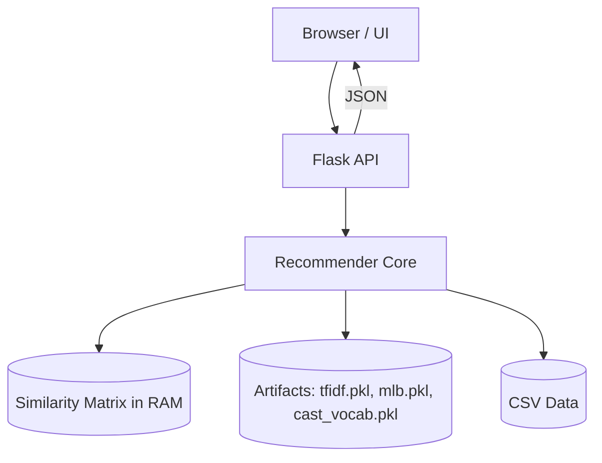

# PHẦN NỘI DUNG BÁO CÁO HỆ THỐNG GỢI Ý PHIM

> Phiên bản: 1.1  
> Ngày cập nhật: 2025-10-06  
> Dự án: Movie Recommendation System (Vietnamese Films)

---
## MỤC LỤC
1. [Chương 1: Tổng quan và cơ sở lý thuyết](#chương-1-tổng-quan-và-cơ-sở-lý-thuyết)  
2. [Chương 2: Thu thập và tiền xử lý dữ liệu](#chương-2-thu-thập-và-tiền-xử-lý-dữ-liệu)  
   2.1. [Nguồn dữ liệu và web scraping](#21-nguồn-dữ-liệu-và-web-scraping)  
   2.2. [Tiền xử lý dữ liệu](#22-tiền-xử-lý-dữ-liệu)  
3. [Chương 3: Trích xuất đặc trưng](#chương-3--trích-xuất-đặc-trưng)  
4. [Chương 4: Thiết kế và xây dựng mô hình](#chương-4-thiết-kế-và-xây-dựng-mô-hình)  
5. [Chương 5: Hệ thống gợi ý](#chương-5-hệ-thống-gợi-ý)  
6. [Chương 6: Giao diện web và kiến trúc hệ thống](#chương-6-giao-diện-web-và-kiến-trúc-hệ-thống)  
7. [Phụ lục](#phụ-lục)  

---
## CHƯƠNG 1: TỔNG QUAN VÀ CƠ SỞ LÝ THUYẾT
### 1.1. Bối cảnh và động lực
- Sự bùng nổ nội dung số và nhu cầu cá nhân hóa trải nghiệm người dùng.  
- Phim Việt Nam có dữ liệu phân tán, thiếu chuẩn hóa: cần hệ thống tổng hợp & gợi ý.  
- Hệ thống gợi ý giúp tăng: (1) Thời gian tương tác, (2) Mức độ hài lòng, (3) Khả năng khám phá nội dung dài đuôi (long-tail).  

### 1.2. Bài toán gợi ý (Recommender System Problem)
- Đầu vào: Tập hợp phim F, người dùng U, tương tác (lượt xem, đánh giá, yêu thích, mô tả nội dung).  
- Đầu ra: Danh sách k phim phù hợp nhất cho 1 người dùng tại thời điểm t.  
- Thách thức: Dữ liệu thưa thớt (sparse), cold-start, thiên lệch xu hướng (popularity bias), đa chiều ngữ nghĩa.  

### 1.3. Các hướng tiếp cận chính
| Phương pháp | Ý tưởng | Ưu điểm | Hạn chế |
|-------------|---------|---------|--------|
| Content-based Filtering | Dựa trên đặc trưng nội dung của phim | Không cần nhiều lịch sử người dùng | Dễ bị "khóa sở thích" (overspecialization) |
| Collaborative Filtering (CF) | Dựa vào hành vi tương tự giữa người dùng hoặc giữa item | Khám phá được sở thích tiềm ẩn | Khó khi dữ liệu thưa thớt |
| Hybrid | Kết hợp hai hoặc nhiều phương pháp | Giảm hạn chế từng loại | Tăng độ phức tạp |

### 1.4. Thuật toán tiêu biểu
- Content-based: TF-IDF + Cosine Similarity, Word Embedding, BERT-based embedding.  
- Collaborative Filtering: User-User, Item-Item, Matrix Factorization (SVD), Implicit ALS.  
- Hybrid: Trộn điểm (weighted), xếp hạng hợp nhất (rank aggregation), cascade model.  

### 1.5. Các khái niệm kỹ thuật
- Vector hóa văn bản: Bag-of-Words, TF-IDF, n-grams.  
- Ma trận tương đồng: Cosine / Dot product.  
- Suy diễn ngữ nghĩa: Word2Vec / FastText / SentenceTransformer.  
- Giảm chiều: PCA, TruncatedSVD (cho dữ liệu thưa).  

### 1.6. Thách thức cụ thể với tiếng Việt
- Dính từ (tokenization khó).  
- Dấu thanh làm tăng biến thể.  
- Tên riêng (diễn viên, đạo diễn) lẫn trong mô tả.  
- Thuật ngữ vay mượn (English mix) – cần chuẩn hóa.  

### 1.7. Mục tiêu hệ thống
- Tái sử dụng được (modular).  
- Cập nhật dữ liệu bán tự động (scraping + pipeline).  
- Thời gian gợi ý < 300ms/truy vấn.  
- Dễ mở rộng bổ sung CF hoặc đánh giá người dùng thật.  

### 1.8. Ví dụ minh họa nhanh
Ví dụ logic tính độ tương đồng giữa hai mô tả phim bằng TF-IDF + Cosine:
```python
from sklearn.feature_extraction.text import TfidfVectorizer
from sklearn.metrics.pairwise import cosine_similarity

movies = [
    "Một chàng trai nghèo vượt khó vươn lên trong xã hội phong kiến.",
    "Câu chuyện cảm động về chàng trai nghèo cố gắng thay đổi số phận.",
    "Phi thuyền du hành vào không gian khám phá hành tinh mới." 
]

vec = TfidfVectorizer()
X = vec.fit_transform(movies)
# Cosine giữa phim 0 và các phim còn lại
sims = cosine_similarity(X[0], X).ravel()
print(sims)  # Hai phim đầu tương đồng cao, phim thứ 3 thấp
```

---
## CHƯƠNG 2: THU THẬP VÀ TIỀN XỬ LÝ DỮ LIỆU
### 2.1. Nguồn dữ liệu và web scraping
#### 2.1.1. Nguồn dữ liệu
- Website phim Việt (ví dụ: chuyên trang tổng hợp phim).  
- Các cổng tổng hợp rating quốc tế (nếu có bản Việt).  
- Dữ liệu nội bộ: file CSV `films_vn.csv`, `films_vn_with_content.csv`.  

#### 2.1.2. Trường dữ liệu chính
| Trường | Mô tả | Ý nghĩa trong mô hình |
|--------|------|------------------------|
| title | Tên phim | Khóa chính / hiển thị |
| description | Nội dung tóm tắt | Vector nội dung |
| genre | Thể loại | Phân cụm / lọc truy vấn |
| actors / cast | Diễn viên | Mở rộng ngữ nghĩa |
| director | Đạo diễn | Bổ sung trọng số |
| rating | Điểm đánh giá | Đề xuất ưu tiên |
| year | Năm phát hành | Lọc xu hướng |
| country | Quốc gia | Lọc theo ngữ cảnh |

#### 2.1.3. Công cụ scraping
- Requests + BeautifulSoup: thu thập HTML tĩnh.  
- Selenium (nếu trang động).  
- Throttle (time.sleep, headers) tránh bị chặn.  
- Lưu tạm dạng CSV trước khi hợp nhất.  

#### 2.1.4. Quy trình scraping chuẩn hóa
1. Xác định sitemap / pattern URL.  
2. Thu thập danh sách URL phim.  
3. Trích xuất trường (title, year, genre, content, cast...).  
4. Làm sạch ký tự HTML, bỏ tag.  
5. Ghi log lỗi (phim lỗi -> file missing.log).  
6. Hợp nhất & loại trùng.  

#### 2.1.5. Rủi ro & xử lý
- Block IP: dùng xoay vòng user-agent.  
- Dữ liệu thiếu trường: đánh dấu NULL -> xử lý sau.  
- Encoding tiếng Việt lỗi: đảm bảo UTF-8, dùng `errors='ignore'` khi cần.  

#### 2.1.6. Ví dụ code: Web Scraping cơ bản (Requests + BeautifulSoup)
```python
import time, csv, re, unicodedata
import requests
from bs4 import BeautifulSoup
from pathlib import Path

BASE_URL = "https://example-phim.vn"  # Thay bằng domain thật
HEADERS = {"User-Agent": "Mozilla/5.0"}
OUTPUT = Path("raw_films.csv")

FIELDS = ["title", "year", "genre", "description", "cast", "rating"]

def fetch_html(url: str):
    for attempt in range(3):
        try:
            r = requests.get(url, headers=HEADERS, timeout=10)
            if r.status_code == 200:
                return r.text
        except requests.RequestException:
            time.sleep(1 + attempt)
    return None

def parse_film(detail_url: str):
    html = fetch_html(detail_url)
    if not html:
        return None
    soup = BeautifulSoup(html, "html.parser")
    def safe_sel(css):
        el = soup.select_one(css)
        return el.get_text(strip=True) if el else ""
    title = safe_sel("h1.title")
    year = re.findall(r"(19|20)\d{2}", safe_sel(".year"))
    genre = ",".join([g.get_text(strip=True) for g in soup.select('.genres a')])
    desc = safe_sel(".description")
    cast = ",".join([c.get_text(strip=True) for c in soup.select('.cast .actor')])
    rating = safe_sel('.rating span')
    return {
        "title": title,
        "year": year[0] if year else "",
        "genre": genre,
        "description": desc,
        "cast": cast,
        "rating": rating
    }

def crawl_listing(list_url: str, limit=50):
    html = fetch_html(list_url)
    if not html:
        return []
    soup = BeautifulSoup(html, "html.parser")
    detail_links = [a['href'] for a in soup.select('.film-item a.details')][:limit]
    results = []
    for i, link in enumerate(detail_links, 1):
        full = link if link.startswith('http') else BASE_URL + link
        film = parse_film(full)
        if film:
            results.append(film)
        time.sleep(0.5)  # throttle nhẹ
        if i % 10 == 0:
            print(f"Crawled {i} films...")
    return results

if __name__ == "__main__":
    films = crawl_listing(f"{BASE_URL}/danh-sach/phim-moi", limit=30)
    if films:
        with OUTPUT.open("w", newline='', encoding='utf-8') as f:
            writer = csv.DictWriter(f, fieldnames=FIELDS)
            writer.writeheader()
            writer.writerows(films)
        print("Saved:", OUTPUT)
```

#### 2.1.7. Ví dụ code: Selenium (trường hợp trang động)
```python
from selenium import webdriver
from selenium.webdriver.chrome.options import Options
from selenium.webdriver.common.by import By
import time

def init_browser():
    opts = Options()
    opts.add_argument('--headless=new')
    driver = webdriver.Chrome(options=opts)
    return driver

def scrape_dynamic(url):
    driver = init_browser()
    driver.get(url)
    time.sleep(2)
    films = []
    cards = driver.find_elements(By.CSS_SELECTOR, '.film-card')
    for c in cards[:20]:
        try:
            title = c.find_element(By.CSS_SELECTOR, '.title').text
            year = c.find_element(By.CSS_SELECTOR, '.year').text
            films.append({"title": title, "year": year})
        except Exception:
            pass
    driver.quit()
    return films
```

### 2.2. Tiền xử lý dữ liệu
#### 2.2.1. Làm sạch
- Loại bỏ dòng thiếu > 70% trường quan trọng.  
- Chuẩn hóa khoảng trắng, xuống dòng.  
- Chuyển tất cả về chữ thường (trừ tên riêng nếu cần).  

#### 2.2.2. Xử lý văn bản tiếng Việt
- Tách từ: dùng thư viện underthesea / vncorenlp (gợi ý tương lai).  
- Loại dấu câu, số không cần thiết.  
- Bỏ stopwords (file `vietnamese-stopwords.txt`).  
- Chuẩn hóa Unicode NFC.  

#### 2.2.3. Chuẩn hóa thể loại
- Phân tách nhiều thể loại bằng dấu phẩy.  
- Mapping alias: "Hành động" ~ "Action".  
- Chuẩn hóa: không dấu + lower để so trùng.  

#### 2.2.4. Xử lý dữ liệu thiếu
| Trường | Chiến lược |
|--------|------------|
| description | Bỏ nếu rỗng hoàn toàn |
| genre | Gán "khác" nếu thiếu |
| rating | Gán trung vị (median) |
| year | Bỏ nếu ngoài khoảng hợp lệ (1900–2030) |

#### 2.2.5. Loại trùng lặp
- So khớp dựa trên: title chuẩn hóa + year.  
- Nếu 2 mô tả tương đồng > 0.9 (cosine TF-IDF) => giữ bản đầy đủ hơn.  

#### 2.2.6. Lưu trữ trung gian
- Stage 1: raw.csv  
- Stage 2: cleaned.csv  
- Stage 3: enriched_features.csv  

#### 2.2.7. Kiểm tra chất lượng dữ liệu (Data Quality Checklist)
- Tỷ lệ thiếu theo cột < 10%.  
- Không trùng khóa chính.  
- Thống kê phân bố độ dài mô tả (mean, std).  
- Số lượng thể loại duy nhất hợp lý (< 200).  

#### 2.2.8. Ví dụ code: Tiền xử lý với Pandas
```python
import pandas as pd, unicodedata, re
from pathlib import Path

RAW = Path('raw_films.csv')
STOPWORDS = set(Path('vietnamese-stopwords.txt').read_text(encoding='utf-8').splitlines())

# Hàm chuẩn hóa Unicode + bỏ ký tự thừa
def normalize_text(s: str):
    if not isinstance(s, str):
        return ''
    s = unicodedata.normalize('NFC', s)
    s = s.strip().replace('\u00a0', ' ')
    s = re.sub(r'\s+', ' ', s)
    return s

try:
    import underthesea
    def tokenize_vi(s: str):
        return underthesea.word_tokenize(s, format="text")
except ImportError:
    def tokenize_vi(s: str):
        return s.lower()

def remove_stopwords(tokens: str):
    return ' '.join([w for w in tokens.split() if w.lower() not in STOPWORDS and len(w) > 1])

def clean_df(df: pd.DataFrame):
    df = df.copy()
    for col in ['title','description','genre','cast']:
        df[col] = df[col].fillna('').map(normalize_text)
    # Bỏ dòng tỉ lệ missing > 70% (ở đây đơn giản: description trống)
    df = df[df['description'].str.len() > 20]
    # Chuẩn hóa description -> tokenize -> remove stopwords
    df['description_clean'] = df['description'].map(tokenize_vi).map(remove_stopwords)
    # Chuẩn hóa genre
    df['genre_list'] = (df['genre'].str.lower()
                                  .str.replace('phim', '', regex=False)
                                  .str.split(',')
                                  .apply(lambda lst: [g.strip() for g in lst if g.strip()]))
    # Rating numeric
    df['rating'] = pd.to_numeric(df['rating'], errors='coerce')
    df['rating'] = df['rating'].fillna(df['rating'].median())
    # Year
    df['year'] = pd.to_numeric(df['year'], errors='coerce')
    df = df[(df['year'].isna()) | ((df['year']>=1900) & (df['year']<=2030))]
    return df

if RAW.exists():
    raw_df = pd.read_csv(RAW, encoding='utf-8')
    cleaned = clean_df(raw_df)
    cleaned.to_csv('cleaned_films.csv', index=False, encoding='utf-8')
    print("Saved cleaned_films.csv, rows=", len(cleaned))
```

#### 2.2.9. Ví dụ code: Loại trùng dựa trên tiêu đề + tương đồng mô tả
```python
import pandas as pd
from sklearn.feature_extraction.text import TfidfVectorizer
from sklearn.metrics.pairwise import cosine_similarity

cleaned = pd.read_csv('cleaned_films.csv')
cleaned['title_norm'] = cleaned['title'].str.lower().str.replace(r'[^a-z0-9]+','', regex=True)

# Giữ bản đầu tiên, so tương đồng các bản sau
vectorizer = TfidfVectorizer(max_features=5000)
X = vectorizer.fit_transform(cleaned['description_clean'])

keep_idx = []
seen_titles = {}
for i, row in cleaned.iterrows():
    norm = row['title_norm']
    if norm not in seen_titles:
        seen_titles[norm] = i
        keep_idx.append(i)
    else:
        # So mô tả với bản đầu
        j = seen_titles[norm]
        sim = cosine_similarity(X[i], X[j])[0,0]
        if sim < 0.9:  # khác biệt đáng kể => giữ thêm
            keep_idx.append(i)

dedup = cleaned.loc[keep_idx]
dedup.to_csv('dedup_films.csv', index=False)
print('Rows before:', len(cleaned), 'after:', len(dedup))
```

---
## CHƯƠNG 3 : TRÍCH XUẤT ĐẶC TRƯNG
### 3.1. Mục tiêu
Chuyển đổi dữ liệu văn bản và danh mục thành vector số để tính tương đồng và phục vụ mô hình.

### 3.2. Đặc trưng nội dung
- TF-IDF trên `description` (unigram + bigram).  
- Encoding `genre` dạng multi-hot vector.  
- Diễn viên / đạo diễn: tần suất xuất hiện -> trọng số.  

#### 3.2.1. Ví dụ code: Xây dựng TF-IDF + Multi-hot Genre
```python
import pandas as pd
from sklearn.feature_extraction.text import TfidfVectorizer
from sklearn.preprocessing import MultiLabelBinarizer
from scipy.sparse import hstack, csr_matrix

films = pd.read_csv('dedup_films.csv')

# TF-IDF cho mô tả đã làm sạch
vec = TfidfVectorizer(max_features=20000, ngram_range=(1,2), min_df=2)
X_desc = vec.fit_transform(films['description_clean'])

# Genre multi-hot
mlb = MultiLabelBinarizer()
X_genre = mlb.fit_transform(films['genre_list'])
X_genre = csr_matrix(X_genre)

# Cast trọng số đơn giản: tần suất diễn viên
from collections import Counter
cast_tokens = films['cast'].fillna('').str.lower().str.split(',')
all_cast = Counter([c.strip() for lst in cast_tokens for c in lst if c.strip()])
# Lấy top 500 diễn viên
top_cast = [c for c,_ in all_cast.most_common(500)]
cast_index = {c:i for i,c in enumerate(top_cast)}
import numpy as np
rows, cols, data = [], [], []
for r, lst in enumerate(cast_tokens):
    for c in lst:
        c2 = c.strip()
        if c2 in cast_index:
            rows.append(r); cols.append(cast_index[c2]); data.append(1.0)
from scipy.sparse import coo_matrix
X_cast = coo_matrix((data,(rows,cols)), shape=(len(films), len(top_cast))).tocsr()

# Kết hợp (có thể áp dụng trọng số)
alpha, beta, gamma = 1.0, 0.6, 0.4
X_full = hstack([alpha*X_desc, beta*X_genre, gamma*X_cast]).tocsr()
print(X_full.shape)
```

#### 3.4.1. Ví dụ code: Tính ma trận tương đồng & lưu
```python
from sklearn.metrics.pairwise import cosine_similarity
import numpy as np

# Cảnh báo: Tính toàn bộ similarity có thể tốn RAM nếu > 10k phim
S = cosine_similarity(X_full)
np.save('similarity.npy', S)
print('Saved similarity.npy, shape=', S.shape)
```

#### 3.6.1. Ví dụ code: Kiểm tra top phim tương tự
```python
import pandas as pd, numpy as np
films = pd.read_csv('dedup_films.csv')
S = np.load('similarity.npy')

def top_sim(title: str, k=5):
    idx = films[films['title'].str.lower()==title.lower()].index
    if len(idx)==0:
        return []
    i = idx[0]
    sims = S[i]
    top_idx = sims.argsort()[::-1][1:k+1]  # bỏ chính nó
    return list(zip(films.iloc[top_idx]['title'], sims[top_idx]))

print(top_sim('Tên Phim Ví Dụ', k=5))
```

---
## CHƯƠNG 4: THIẾT KẾ VÀ XÂY DỰNG MÔ HÌNH
### 4.1. Kiến trúc logic mô hình
1. Load dữ liệu đã làm sạch.  
2. Vector hóa nội dung.  
3. Xây dựng / tải ma trận tương đồng.  
4. Xử lý truy vấn người dùng (input phim / từ khóa).  
5. Trả về danh sách phim tương tự đã xếp hạng.  

### 4.2. Pipeline (Pseudo)
```
load_clean_data()
X_text = tfidf.fit_transform(descriptions)
X_genre = multi_hot(genre)
X_cast = build_cast_vectors(cast)
X = hstack([α*X_text, β*X_genre, γ*X_cast])
S = cosine_similarity(X)
save(S)
```

### 4.2.1. Ví dụ code: Script pipeline đầy đủ (pipeline_build.py)
```python
# pipeline_build.py
import pandas as pd, numpy as np, pickle
from sklearn.feature_extraction.text import TfidfVectorizer
from sklearn.preprocessing import MultiLabelBinarizer
from sklearn.metrics.pairwise import cosine_similarity
from scipy.sparse import hstack, csr_matrix, coo_matrix
from collections import Counter

INPUT = 'dedup_films.csv'
ARTIFACT_DIR = 'artifacts'
import os; os.makedirs(ARTIFACT_DIR, exist_ok=True)

alpha, beta, gamma = 1.0, 0.6, 0.4

print('[1] Load data')
films = pd.read_csv(INPUT)

print('[2] TF-IDF')
vec = TfidfVectorizer(max_features=20000, ngram_range=(1,2), min_df=2)
X_desc = vec.fit_transform(films['description_clean'])

print('[3] Genre multi-hot')
mlb = MultiLabelBinarizer()
X_genre = mlb.fit_transform(eval(x) if isinstance(x,str) and x.startswith('[') else x for x in films['genre_list']) if 'list' not in str(type(films['genre_list'].iloc[0])) else mlb.fit_transform(films['genre_list'])
X_genre = csr_matrix(X_genre)

print('[4] Cast matrix')
cast_tokens = films['cast'].fillna('').str.lower().str.split(',')
all_cast = Counter([c.strip() for lst in cast_tokens for c in lst if c.strip()])
top_cast = [c for c,_ in all_cast.most_common(500)]
cast_index = {c:i for i,c in enumerate(top_cast)}
rows, cols, data = [], [], []
for r, lst in enumerate(cast_tokens):
    for c in lst:
        c2 = c.strip()
        if c2 in cast_index:
            rows.append(r); cols.append(cast_index[c2]); data.append(1.0)
X_cast = coo_matrix((data,(rows,cols)), shape=(len(films), len(top_cast))).tocsr()

print('[5] Combine')
X_full = hstack([alpha*X_desc, beta*X_genre, gamma*X_cast]).tocsr()

print('[6] Similarity (may be large)')
S = cosine_similarity(X_full)
np.save(f'{ARTIFACT_DIR}/similarity.npy', S)

print('[7] Save artifacts')
with open(f'{ARTIFACT_DIR}/tfidf.pkl','wb') as f: pickle.dump(vec,f)
with open(f'{ARTIFACT_DIR}/mlb.pkl','wb') as f: pickle.dump(mlb,f)
with open(f'{ARTIFACT_DIR}/cast_vocab.pkl','wb') as f: pickle.dump(top_cast,f)
films.to_csv(f'{ARTIFACT_DIR}/films_reference.csv', index=False)
print('Done.')
```

### 4.3. Đánh giá offline
- Phương pháp: Manual relevance + giả lập truy vấn.  
- Metric gợi ý: Precision@K, Coverage, Diversity.  
- Mô tả kịch bản test: chọn 20 phim tiêu biểu nhiều thể loại.  

#### 4.3.1. Ví dụ code: Precision@K trên tập truy vấn thủ công
```python
import numpy as np, pandas as pd

films = pd.read_csv('artifacts/films_reference.csv')
S = np.load('artifacts/similarity.npy')

# Giả sử có dictionary mapping title -> danh sách label thể loại chuẩn (genres)
films['primary_genre'] = films['genre_list'].apply(lambda lst: lst[0] if isinstance(lst, list) and lst else None)

def precision_at_k(i, k=5):
    sims = S[i]
    top = sims.argsort()[::-1][1:k+1]
    g0 = films.iloc[i]['primary_genre']
    if not g0:
        return 0.0
    hit = sum(films.iloc[j]['primary_genre']==g0 for j in top)
    return hit / k

indices = np.random.choice(len(films), size=min(20, len(films)), replace=False)
precs = [precision_at_k(i, k=5) for i in indices]
print('Mean Precision@5 =', np.mean(precs))
```

### 4.4. Tối ưu hiệu năng
- Cache ma trận tương đồng.  
- Chỉ lưu top-N lân cận (Approximate Nearest Neighbors — có thể nâng cấp FAISS).  
- Giảm kích thước TF-IDF bằng min_df, max_features.  

#### 4.4.1. Ví dụ code: Chỉ lưu Top-N lân cận thay vì full matrix
```python
import numpy as np
from heapq import nlargest

S = np.load('artifacts/similarity.npy')
N_NEIGHBORS = 30
neighbors = []  # danh sách mỗi hàng: [(idx, score), ...]
for i, row in enumerate(S):
    # Lấy top N + bỏ chính nó
    pairs = [(j, row[j]) for j in range(len(row)) if j != i]
    top_pairs = nlargest(N_NEIGHBORS, pairs, key=lambda x: x[1])
    neighbors.append(top_pairs)

# Lưu dạng nén
import pickle
with open('artifacts/top_neighbors.pkl','wb') as f:
    pickle.dump(neighbors, f)
```

### 5.1. Luồng xử lý yêu cầu
1. Người dùng nhập tên phim hoặc từ khóa.  
2. Hệ thống tìm phim gốc gần nhất (fuzzy match).  
3. Truy xuất vector tương ứng.  
4. Lấy danh sách top-N tương đồng (lọc trùng + chính nó).  
5. Trả dữ liệu JSON cho frontend.  

### 5.2. Chức năng chính
- Gợi ý theo phim tương tự (item-based).  
- Gợi ý theo thể loại.  
- Gợi ý nổi bật (top rating).  
- Gợi ý ngẫu nhiên có kiểm soát để tăng đa dạng.  

#### 5.2.1. Ví dụ code: Hàm recommend đơn giản
```python
import numpy as np, pandas as pd
from difflib import get_close_matches

films = pd.read_csv('artifacts/films_reference.csv')
S = np.load('artifacts/similarity.npy')

TITLE_INDEX = {t.lower(): i for i, t in enumerate(films['title'])}

def find_title(query: str):
    q = query.lower().strip()
    if q in TITLE_INDEX:
        return TITLE_INDEX[q]
    cand = get_close_matches(q, TITLE_INDEX.keys(), n=1, cutoff=0.6)
    return TITLE_INDEX[cand[0]] if cand else None

def recommend(query: str, top=10):
    idx = find_title(query)
    if idx is None:
        return []
    sims = S[idx]
    best = sims.argsort()[::-1]
    recs = []
    for j in best:
        if j == idx: continue
        recs.append({
            'title': films.iloc[j]['title'],
            'score': float(sims[j]),
            'genre': films.iloc[j]['genre_list']
        })
        if len(recs) == top:
            break
    return recs

print(recommend('Tên Phim Ví Dụ', top=5))
```

#### 5.2.2. Ví dụ code: API Flask (api.py)
```python
from flask import Flask, request, jsonify
import numpy as np, pandas as pd
from difflib import get_close_matches
import pickle, time

app = Flask(__name__)
films = pd.read_csv('artifacts/films_reference.csv')
S = np.load('artifacts/similarity.npy')
TITLE_INDEX = {t.lower(): i for i, t in enumerate(films['title'])}

@app.get('/api/recommend')
def api_recommend():
    started = time.time()
    title = request.args.get('title', '')
    top = int(request.args.get('top', 10))
    q = title.lower().strip()
    if q not in TITLE_INDEX:
        cand = get_close_matches(q, TITLE_INDEX.keys(), n=1, cutoff=0.6)
        if not cand:
            return jsonify({'query': title, 'results': [], 'message': 'Không tìm thấy phim.'}), 404
        q = cand[0]
    idx = TITLE_INDEX[q]
    sims = S[idx]
    best = sims.argsort()[::-1]
    results = []
    for j in best:
        if j == idx: continue
        results.append({
            'title': films.iloc[j]['title'],
            'score': round(float(sims[j]),4),
            'genre': films.iloc[j]['genre_list']
        })
        if len(results) == top: break
    return jsonify({'query': title, 'matched': films.iloc[idx]['title'], 'results': results, 'latency_ms': int((time.time()-started)*1000)})

if __name__ == '__main__':
    app.run(debug=True)
```

#### 5.4.1. Ví dụ code: Logging + theo dõi truy vấn
```python
import logging, time
logging.basicConfig(filename='recommender.log', level=logging.INFO, format='%(asctime)s %(levelname)s %(message)s')

def log_query(query: str, n_results: int, latency_ms: int):
    logging.info(f"QUERY q='{query}' results={n_results} latency_ms={latency_ms}")
```

### 5.5. Chỉ số đánh giá sau triển khai (nếu có user interaction)
- CTR (Click Through Rate).  
- Conversion proxy: Tỷ lệ xem chi tiết phim được gợi ý.  
- Novelty score: % phim ít phổ biến vẫn được chọn.  

---
## CHƯƠNG 6: GIAO DIỆN WEB VÀ KIẾN TRÚC HỆ THỐNG
### 6.1. Thành phần
| Layer | Mô tả | Công nghệ |
|-------|------|-----------|
| Presentation | Giao diện nhập & hiển thị kết quả | HTML/CSS/JS (hoặc React nhẹ) |
| API | Endpoint gợi ý | Flask / FastAPI |
| Model Service | Load vectorizer + similarity | Python module |
| Data Layer | CSV / future: DB | SQLite / PostgreSQL (tùy mở rộng) |

### 6.2. Kiến trúc triển khai (đơn giản)
```
Browser --> Flask API --> Recommender Core --> Similarity Matrix (in-memory)
                                 |-> Data Files (.csv, .pkl)
```

#### 6.2.1. Sơ đồ kiến trúc (Mermaid)


### 6.3. Endpoint gợi ý (ví dụ)
- GET `/api/recommend?title=<ten-phim>&top=10`  
- Trả JSON: `{ "query": ..., "results": [ {"title": ..., "score": 0.87, "genre": ...}, ... ] }`  

#### 6.3.1. Ví dụ code: Frontend Fetch (JavaScript)
```javascript
async function getRecommendations(title) {
  const params = new URLSearchParams({ title: title, top: 8 });
  const res = await fetch(`/api/recommend?${params.toString()}`);
  if (!res.ok) {
    const err = await res.json();
    console.error(err.message);
    return [];
  }
  const data = await res.json();
  console.log('Latency(ms):', data.latency_ms);
  return data.results;
}

getRecommendations('Tên Phim Ví Dụ').then(list => {
  list.forEach(item => console.log(item.title, item.score));
});
```

### 6.4. Hiệu năng & tối ưu
- Preload ma trận vào RAM khi khởi động.  
- Lazy load mô tả phim chi tiết khi người dùng chọn.  
- Cache LRU cho truy vấn phổ biến.  

#### 6.4.1. Ví dụ code: Cache kết quả truy vấn phổ biến
```python
from functools import lru_cache

@lru_cache(maxsize=512)
def cached_recommend(title: str, top: int = 10):
    # Tái sử dụng hàm recommend ở trên
    return recommend(title, top=top)
```

### 6.6. UI/UX gợi ý
- Ô gợi ý tự động (autocomplete).  
- Hiển thị nhãn thể loại dạng badge.  
- Gợi ý thứ cấp khi người dùng không tìm thấy phim.  

#### 6.6.1. Ví dụ JSON kết quả
```json
{
  "query": "ten phim vi du",
  "matched": "Tên Phim Ví Dụ",
  "results": [
    {"title": "Phim Gợi Ý 1", "score": 0.8741, "genre": ["hanh dong", "tam ly"]},
    {"title": "Phim Gợi Ý 2", "score": 0.8612, "genre": ["tam ly"]}
  ],
  "latency_ms": 42
}
```

---
## PHỤ LỤC
### A. File dữ liệu chính
- `films_vn.csv`: dữ liệu phim cơ bản.  
- `films_vn_with_content.csv`: có thêm mô tả nội dung.  
- `sim_matrix.csv`: ma trận tương đồng được tính trước.  

### B. Gợi ý cải tiến tương lai
- Bổ sung collaborative filtering (implicit feedback).  
- Áp dụng re-ranking đa mục tiêu (đa dạng + độ mới).  
- Học embedding đa trường (title + genre + cast).  
- Sử dụng semantic search bằng bi-encoder.  

### C. Danh sách thuật ngữ
| Thuật ngữ | Giải thích ngắn |
|----------|-----------------|
| TF-IDF | Trọng số phản ánh mức độ quan trọng của từ trong văn bản |
| Cosine Similarity | Độ tương đồng góc giữa hai vector |
| Vector hóa | Chuyển đổi dữ liệu thành dạng số |
| Cold-start | Thiếu thông tin khi người dùng/item mới |
| Hybrid | Kết hợp nhiều kỹ thuật gợi ý |

### D. Checklist kiểm thử thủ công
- [ ] Truy vấn 1 phim có dữ liệu đầy đủ.  
- [ ] Truy vấn phim có tên gần giống (fuzzy).  
- [ ] Truy vấn phim không tồn tại -> thông báo.  
- [ ] Thời gian phản hồi < 0.3s.  
- [ ] Không trả về chính phim nguồn ở vị trí đầu (tùy yêu cầu).  

### E. Yêu cầu môi trường & Cài đặt nhanh
```bash
# Tạo môi trường ảo (Windows PowerShell)
python -m venv .venv
.venv\\Scripts\\activate

pip install --upgrade pip
pip install pandas scikit-learn numpy scipy flask underthesea beautifulsoup4 requests

# Chạy build pipeline
python pipeline_build.py
# Chạy API
python api.py
```

```text
Gợi ý phiên bản:
- Python >= 3.10
- scikit-learn ~= 1.4
- pandas >= 2.0
- numpy >= 1.24
```

### F. Troubleshooting nhanh
| Vấn đề | Nguyên nhân khả dĩ | Cách xử lý |
|--------|--------------------|------------|
| Unicode lỗi ký tự | File không phải UTF-8 | Dùng encoding='utf-8' & kiểm tra BOM |
| RAM đầy khi tính similarity | S quá lớn (O(n^2)) | Chỉ tính top-N, dùng ANN (FAISS) |
| Gợi ý lặp nhàm chán | Thiếu đa dạng | Thêm diversification (MMR) |
| Không tìm thấy phim | Sai chính tả | Áp dụng fuzzy matching / gợi ý gần đúng |
| API chậm >300ms | Load matrix nhiều lần | Preload khi start, bật cache |

---
## GHI CHÚ
Tài liệu này có thể tiếp tục mở rộng khi bổ sung thuật toán hoặc thay đổi pipeline. Các phần nên cập nhật: chương 3 (embedding), chương 4 (đánh giá), chương 6 (kiến trúc mở rộng đa dịch vụ).

---
© 2025 Movie Recommendation System - Internal Documentation
